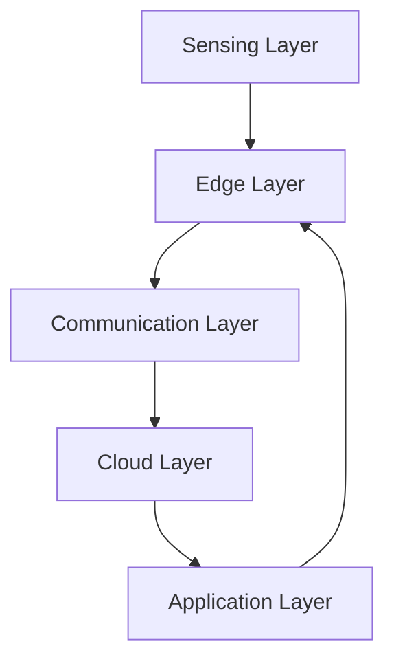

# DiagramCraft

A modern, web-based diagram editor powered by Mermaid.js. Create, edit, and export beautiful diagrams with a live preview and integrated code editor.

## Features

- **Live Code Editor**: Edit Mermaid diagrams with syntax highlighting using CodeMirror
- **Real-time Preview**: Instantly see your diagram changes rendered
- **Multiple Export Formats**: Download diagrams as SVG or PNG
- **Clean Interface**: Split-pane design with editor and preview side-by-side
- **Error Handling**: Clear error messages for invalid diagram syntax

## Tech Stack

- **React 19** - UI framework
- **Vite** - Build tool and dev server
- **Mermaid.js** - Diagram rendering engine
- **CodeMirror** - Code editor component
- **html-to-image** - PNG export functionality

## Getting Started

### Prerequisites

- Node.js (version 16 or higher recommended)
- npm or yarn

### Installation

1. Clone the repository:
```bash
git clone https://github.com/sandeepvashishtha/DiagramCraft.git
cd DiagramCraft
```

2. Install dependencies:
```bash
npm install
```

3. Start the development server:
```bash
npm run dev
```

4. Open your browser and navigate to `http://localhost:5173`

## Usage

1. **Edit Diagrams**: Use the code editor on the left to write or modify Mermaid diagram syntax
2. **Render**: Click the "Render" button to preview your diagram
3. **Export**: Download your diagram as SVG or PNG using the toolbar buttons

### Example Diagram



## Available Scripts

- `npm run dev` - Start development server
- `npm run build` - Build for production
- `npm run preview` - Preview production build
- `npm run lint` - Run ESLint

## Supported Diagram Types

DiagramCraft supports all Mermaid diagram types, including:

- Flowcharts
- Sequence Diagrams
- Class Diagrams
- State Diagrams
- Entity Relationship Diagrams
- User Journey
- Gantt Charts
- Pie Charts
- Git Graphs
- And more!

For diagram syntax, visit the [Mermaid.js documentation](https://mermaid.js.org/).

## License

This project is licensed under the MIT License.

## Contributing

Contributions are welcome! Please feel free to submit a Pull Request.
